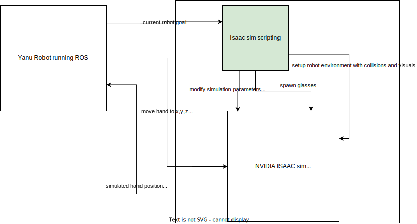
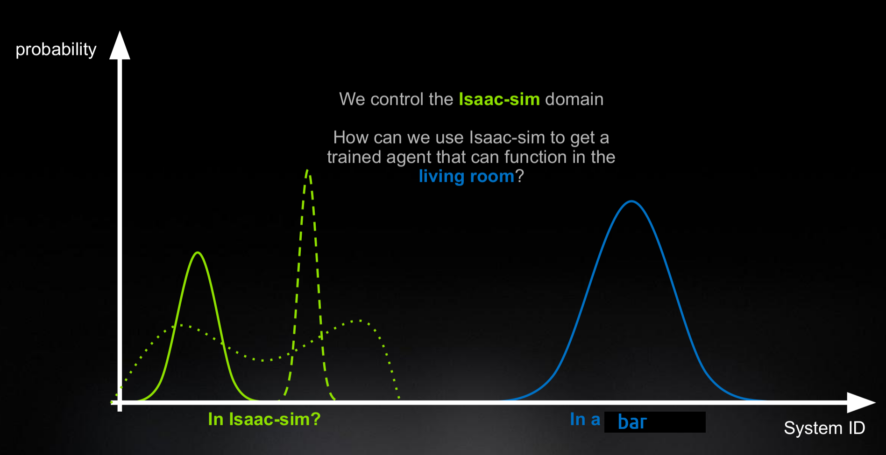

# Yanu Digital Twin with Isaac Sim

## Summary

| Company | [Yanu](https://yanu.ai/) |
| :--- | :--- |
| Project Manager | [Project Manager TODO](https://profile.link) |
| Profject Team | [Kristjan Laht](https://github.com/KingBoomie); [Houman Masnavi](https://www.linkedin.com/in/houman-masnavi/?originalSubdomain=ee) |
| Challenge Tackled | 3d model optimization;  |
| Technology Used | nvidia isaac robot simulator; ROS;  |

## Objectives of the Demonstration Project
The objective of this project was to develop an N-dimensional digital twin for YANU robotic cells. The digital twin is expected to provide validation of new algorithms in a safe way, thus reducing potential system downtime, and model-based testing of full systems integrations and its upgrades before deployment on the live system.

## Activities and results of demonstration project
### Challenge addressed (i.e. whether and how the initial challenge was changed during the project, for which investment the demonstration project was provided)*
- Creating a simulation environment based in Isaac Sim for the Yanu robot. Modifying the models to function in real time. 

### Data sources (which data was used for the technological solution)
- Openly available physical models of the Panda robot arm and proprietary model of the Yanu workspace / robot.  

### Description and justifictaion of used AI technology
- Path planning, collision algorithms and physical simulations were used to test the robot in a simulated environment. 

### Results of testing and validating technological solution
- The Yanu robot can perform drink creation __sometimes__. The simulated robot performs similarly to the real robot even in erronous cases (displays shakyness and vibrations). It is highly likely that creating a perfectly working control algorithm (without said shakyness and vibrations) using the simulated robot would also mean that the algorithm would work in real life.  

### Technical architecture (presented graphically, where can also be seen how the technical solution integrates with the existing system)*

- The technical architecture involves a photorealistic physics-based simulation environment (NVIDIA Omniverse Isaac Sim) that integrates with the main software backbone (ROS). 

### Potential areas of use of technical solution
- Example solution for other similar robotic environments. Can use the tricks we figured out to work around bugs in ROS and Isaac Sim.

### Lessons learned (i.e. assessment whether the technological solution actually solved the initial challenge)
- Simulation and reality might be very different and not overlap at all. For example in real life bigger things cannot fall through small holes. Due to imperfect collision algorithms, this is very possible in simulation. From the tested 5 collision algorithms, only 2 were barely working, and due to bugs in Isaac sim, only one could actually be used. Since our robot needs to be holding things that fall into its hand, this is almost a show stopper problem. 

- Isaac sim is still a little new and buggy. There were 5+ bugs that needed workarounds (or in one case, actual fixes sent to Nvidia). 

- The created simulation is an okay place to train new robot movement algorithms without breaking a physical robot with impossible movements, but due to manufacturing differences and imperfect collision algorithms, real world testing is indispencable.

### Description of User Interface 
- The simulation UI was not developed for client use, but the default that comes with Isaac Sim looks like the following: 

[robot completing a recipe with some other random glasses standing around](isaac-robot-cup-success.mkv)

## Custom agreement with the AIRE team

*If you have a unique project or specific requirements that don't fit neatly into the Docker file or description template options, we welcome custom agreements with our AIRE team. This option allows flexibility in collaborating with us to ensure your project's needs are met effectively.*

*To explore this option, please contact our demonstration projects service manager via katre.eljas@taltech.ee with the subject line "Demonstration Project Custom Agreement Request - [Your Project Name]." In your email, briefly describe your project and your specific documentation or collaboration needs. Our team will promptly respond to initiate a conversation about tailoring a solution that aligns with your project goals.*

